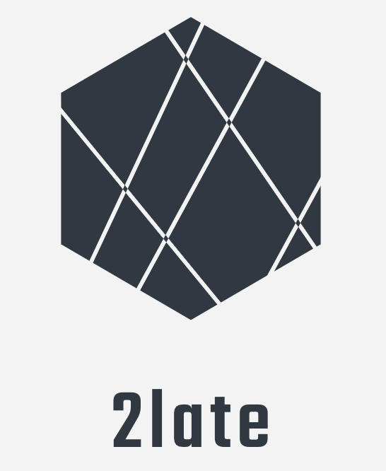

# 2late
Proxy-reencryption module for offline devices

<!-- PROJECT SHIELDS -->
<!--
*** I'm using markdown "reference style" links for readability.
*** Reference links are enclosed in brackets [ ] instead of parentheses ( ).
*** See the bottom of this document for the declaration of the reference variables
*** for contributors-url, forks-url, etc. This is an optional, concise syntax you may use.
*** https://www.markdownguide.org/basic-syntax/#reference-style-links
-->
[![Contributors][contributors-shield]][contributors-url]
[![Forks][forks-shield]][forks-url]
[![Stargazers][stars-shield]][stars-url]
[![Issues][issues-shield]][issues-url]
[![MIT License][license-shield]][license-url]
[![LinkedIn][linkedin-shield]][linkedin-url]


<!-- PROJECT LOGO -->
<br />
<p align="center">
  <a href="https://github.com/netgroup/2late">
    
  </a>

  <h3 align="center">Best-README-Template</h3>

  <p align="center">
    Proxy-reencryption module for offline devices
  </p>
</p>


<!-- ABOUT THE PROJECT -->
## About The Project

[![Product Name Screen Shot][product-screenshot]](https://github.com/netgroup/2late)

Access control in offline, non tamper-proof, low-power devices presents very hard challenges. Among the others, how to properly handle with user revocation primes. 
This is the implementation of a new ElGamal inspired cryptosystem called BURBLE based on a lightweight active security data storage protecting a secret stored on a device. 
A proxy re-encryption service allows to continuously change encryption keys, so that only authorized users can have access to the secret. On their hand, authorized users need to contact a trusted authority to obtain the short-time decryption keys, thus centralising the access control the remote devices. The system offers a protection against attackers even if provided with old keys. 
Thanks to the key rotation, even they tamper the device, they will not get access to the secret as the re-encryption operation likely happened as they arrive too late.

Key features:
* Access control (based on time and data) for offline devices with key revocation
* Perfect forward secrecy also in case of device tampering
* Efficient key derivation for offline devices


### Built With

* [pyca/cryptography](https://cryptography.io/)


<!-- GETTING STARTED -->
## Getting Started

We provide the code for two entity: the Key Management System (KMS) and a device.

* KMS: is an authority which provides a key to the user to access to a given data at a given time. 
* Device: is an offline devices which encrypt a data repository and periodically re-encrypt with the proposed algorithm. User may decrypt a given data at a given time only if provided with the right key by the KMS.

### Prerequisites

This is an example of how to list things you need to use the software and how to install them.
* Clone the repo
   ```sh
   git clone https://github.com/your_username_/Project-Name.git
   ```
* Install python modules 
  ```sh
  pip install -r requirements.txt 
  ```


<!-- USAGE EXAMPLES -->
## Usage

1. Generate a key for a given data (e.g. "dir1") and a given time (e.g., 3) as:
   ```sh
   cd kms
   python gen_key.py 3 "dir1"
   ```
2. Then move to the device and initialize the repository by encrypting all the elements inside a folder.
   For instance with the following command it will encrypt all the folder "data" and place the content in a folder called "enc".
   ```sh
   cd ..
   cd device
   python encrypt.py data enc
   ```
3. Launch the re-encryption module on the encrypted folder
   ```sh
   python reencrypt.py enc
   ```
4. Decrypt a file at a given time. Suppose the user get "12345" as key from the KMS, to decrypt data inside "dir1" at time "3", she/he can type at time 3:
   ```sh
   python decrypt.py enc/dir1/data1 12345
   


<!-- LICENSE -->
## License

Distributed under the MIT License. See `LICENSE` for more information.


<!-- CONTACT -->
## Contact

Lorenzo Bracciale - lorenzo.bracciale@uniroma2.it
Pierpalo Loreti - pierpaolo.loreti@uniroma2.it
Emanuele Raso - emanuele.raso@uniroma2.it
Giuseppe Bianchi - giuseppe.bianchi@uniroma2.it

The work has been submitted to publication.


<!-- MARKDOWN LINKS & IMAGES -->
<!-- https://www.markdownguide.org/basic-syntax/#reference-style-links -->
[product-screenshot]: doc/images/smart_lock.png
